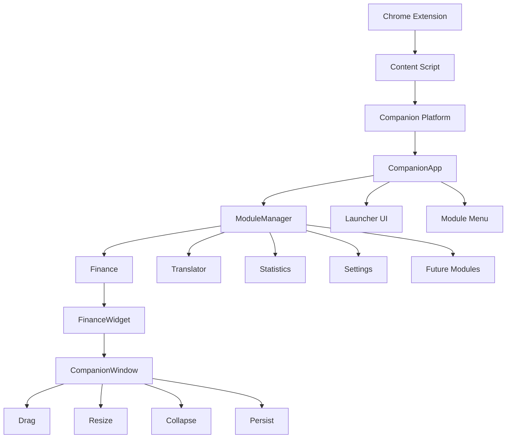

# Companion

A modular productivity platform for GoldenBride CRM.

## Mission

Companion transforms the GoldenBride CRM workflow from manual, repetitive tasks into an intelligent, automated experience. Every second saved compounds into meaningful productivity gains.

## Architecture



## Components

| Component | Responsibility |
|-----------|----------------|
| [CompanionApp](src/companion/companion-app.ts) | Singleton launcher, menu UI, delegates to ModuleManager |
| [ModuleManager](src/companion/module-manager.ts) | Module registration and lifecycle |
| [CompanionWindow](src/companion/companion-window.ts) | Base class for draggable, resizable windows |
| [Finance](src/companion/finance-widget.ts) | Live finance data with shift filtering |

## Folder Structure

```
Companion/
├── src/companion/       Source code
├── scripts/             Built output
├── agencybooster-devtoolkit/  Build tooling
├── assets/              Static resources
├── docs/                Documentation
├── LICENSE              License
├── NOTICE               Copyright notice
└── README.md            This file
```

## Documentation

| Document | Description |
|----------|-------------|
| [Vision](docs/vision.md) | Why Companion exists. Mission, goals, philosophy. |
| [Architecture](docs/architecture.md) | System design, component hierarchy, dependency rules. |
| [Module API](docs/module-api.md) | Module lifecycle, interface, registration patterns. |
| [UI Guidelines](docs/ui-guidelines.md) | Visual standards, spacing, colors, behaviors. |
| [Coding Standards](docs/coding-standards.md) | Naming, typing, formatting, forbidden practices. |
| [Project Structure](docs/project-structure.md) | Directory layout and purpose. |
| [Branding](docs/branding.md) | Logo usage, icon generation, brand consistency. |
| [Security](docs/security.md) | Threat model, protection strategy, limitations. |
| [Build](docs/build.md) | Build pipeline, current and future. |
| [Roadmap](docs/roadmap.md) | Version plan, feature timeline. |
| [Decision Log](docs/decision-log.md) | Architecture Decision Records. |

## Development

### Prerequisites

- Node.js 18+
- TypeScript 5+
- esbuild

### Build

```bash
node agencybooster-devtoolkit/build-finance.mjs
```

### Install

1. Install Tampermonkey browser extension
2. Create new userscript
3. Copy contents of `scripts/Companion.user.js`
4. Navigate to GoldenBride CRM

### Development Mode

Enable diagnostic logging:

```javascript
localStorage.setItem("ab-dev", "1");
```

## Coding Standards

See [Coding Standards](docs/coding-standards.md) for complete guidelines.

### Quick Reference

- **Classes:** PascalCase (`CompanionApp`, `ModuleManager`)
- **Methods:** camelCase (`registerModule`, `getModules`)
- **Constants:** SCREAMING_SNAKE_CASE (`DEFAULT_STATE`, `STORAGE_KEY`)
- **Files:** kebab-case (`companion-app.ts`, `finance-widget.ts`)
- **CSS:** kebab-case (`ab-finance-header`, `ab-companion-launcher`)

## Roadmap

| Version | Theme | Features |
|---------|-------|----------|
| 1.0 | Platform Transition | Chrome Extension, Finance, Settings |
| 1.1 | Language Support | Translator |
| 1.2 | Data Insights | Statistics |
| 1.3 | Automation | Rules |
| 1.4 | Intelligence | AI Assistant |
| 2.0 | Ecosystem | Module SDK, Plugin System |

See [Roadmap](docs/roadmap.md) for detailed timeline.

## License

All Rights Reserved. See [LICENSE](LICENSE).

## Copyright

See [NOTICE](NOTICE).
