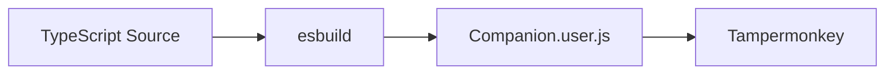
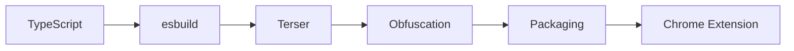

# Build Pipeline

## Overview

Companion uses esbuild for fast TypeScript bundling. The build pipeline is designed for development speed and will evolve for production security.

## Current Pipeline



### Build Command

```bash
node agencybooster-devtoolkit/build-finance.mjs
```

### Build Configuration

| Property | Value |
|----------|-------|
| Entry point | `src/companion/bootstrap.ts` |
| Output | `scripts/Companion.user.js` |
| Format | IIFE |
| Platform | Browser |
| Target | ES2020 |
| Bundle size | ~72kb |

### Build Script

```javascript
// agencybooster-devtoolkit/build-finance.mjs
import { build } from "esbuild";

await build({
    entryPoints: ["../src/companion/bootstrap.ts"],
    bundle: true,
    outfile: "../scripts/Companion.user.js",
    format: "iife",
    platform: "browser",
    target: "es2020",
    minify: false,
    sourcemap: false,
});
```

## TypeScript Configuration

| Setting | Value |
|---------|-------|
| Strict mode | `true` |
| Target | `ES2020` |
| Module | `ES2020` |
| Module resolution | `Bundler` |
| No emit | `true` |

## Development Workflow

1. Edit source files in `src/companion/`
2. Run build command
3. Install updated `scripts/Companion.user.js` in Tampermonkey
4. Refresh target page
5. Enable dev mode: `localStorage.setItem("ab-dev", "1")`

## Future Production Pipeline



### Stage 1: TypeScript Compilation

- Type checking with `tsc --noEmit`
- Strict mode enforced
- No type errors in production

### Stage 2: esbuild Bundling

- Single entry point: `bootstrap.ts`
- All modules bundled into one file
- Tree-shaking for unused code
- Dead code elimination

### Stage 3: Terser Minification

- Variable name mangling
- Whitespace removal
- Code compression
- Console statement removal

### Stage 4: Obfuscation

- String array encoding
- Control flow flattening
- Dead code injection
- Variable randomization

**Note:** Obfuscation provides deterrence, not security. See [Security](security.md).

### Stage 5: Packaging

- Chrome Extension Manifest V3
- Icon generation from `brand-logo.ts`
- Permission declarations
- Content script registration

## Build Output

### Current

| File | Size | Purpose |
|------|------|---------|
| `scripts/Companion.user.js` | ~72kb | Tampermonkey userscript |

### Future

| File | Purpose |
|------|---------|
| `dist/manifest.json` | Chrome Extension manifest |
| `dist/background.js` | Service worker |
| `dist/content.js` | Content script |
| `dist/companion.js` | Bundled application |
| `dist/icons/` | Extension icons |

## Performance

### Bundle Size Budget

| Component | Budget |
|-----------|--------|
| CompanionWindow | ~15kb |
| CompanionApp | ~5kb |
| ModuleManager | ~2kb |
| Finance module | ~30kb |
| Shared utilities | ~5kb |
| **Total** | **~60kb** |

### Load Time Target

| Metric | Target |
|--------|--------|
| Parse time | < 50ms |
| Initialization | < 100ms |
| First paint | < 200ms |

## Quality Checks

Before each release:

1. TypeScript compiles without errors
2. Bundle size within budget
3. No console errors in production mode
4. All keyboard shortcuts functional
5. Widget state persists across sessions
6. Dev mode diagnostics gated correctly
