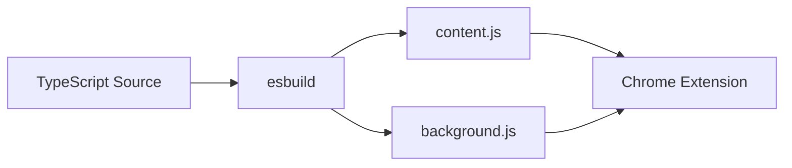
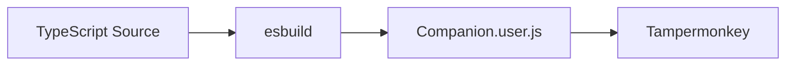

# Build Pipeline

## Overview

Companion supports two deployment targets: Chrome Extension (primary) and Tampermonkey userscript (legacy). The build pipeline uses esbuild for fast TypeScript bundling.

## Build Commands

| Command | Purpose | Output |
|---------|---------|--------|
| `npm run build` | Legacy userscript | `scripts/Companion.user.js` |
| `npm run build:ext` | Chrome Extension (dev) | `extension/dist/` |
| `npm run build:ext:prod` | Chrome Extension (prod) | `extension/dist/` |
| `npm run build:icons` | Generate PNG icons | `extension/icons/` |
| `npm run dev` | Development build | `extension/dist/` |
| `npm run lint` | ESLint check | Console output |
| `npm run typecheck` | TypeScript check | Console output |
| `npm run check` | Lint + typecheck | Console output |

## Chrome Extension (Primary)



### Dev Build

```bash
npm run build:ext
```

| Property | Value |
|----------|-------|
| Entry points | `extension/content.ts`, `extension/background.ts` |
| Output | `extension/dist/` |
| Format | IIFE |
| Target | ES2020 |
| Sourcemaps | Yes |
| Minification | No |

### Production Build

```bash
npm run build:ext:prod
```

| Property | Value |
|----------|-------|
| Entry points | `extension/content.ts`, `extension/background.ts` |
| Output | `extension/dist/` |
| Format | IIFE |
| Target | ES2020 |
| Sourcemaps | No |
| Minification | Yes |

### Build Output

| File | Purpose |
|------|---------|
| `extension/dist/manifest.json` | Chrome Extension manifest |
| `extension/dist/content.js` | Content script bundle |
| `extension/dist/background.js` | Service worker bundle |
| `extension/dist/icons/` | Extension icons |

## Legacy Userscript



### Build Command

```bash
npm run build
```

### Build Configuration

| Property | Value |
|----------|-------|
| Entry point | `src/companion/bootstrap.ts` |
| Output | `scripts/Companion.user.js` |
| Format | IIFE |
| Platform | Browser |
| Target | ES2020 |
| Bundle size | ~73kb |

**Status:** Legacy — retained for development and fallback until Chrome Extension becomes stable.

## Icon Generation

```bash
npm run build:icons
```

Generates PNG icons from `assets/logo.svg`. Requires `sharp` for high-quality rendering. Falls back to placeholder PNGs if sharp is not installed.

| Size | Usage |
|------|-------|
| 16x16 | Favicon, browser tab |
| 32x32 | Extension icon |
| 48x48 | Chrome Web Store listing |
| 128x128 | Chrome Web Store detail |

## TypeScript Configuration

| Setting | Value |
|---------|-------|
| Strict mode | `true` |
| Target | `ES2020` |
| Module | `ES2020` |
| Module resolution | `Bundler` |
| No emit | `true` |

## Development Workflow

### Chrome Extension

1. `npm run dev` — build extension
2. Open `chrome://extensions`
3. Enable "Developer mode"
4. Click "Load unpacked"
5. Select `extension/dist/`
6. Navigate to GoldenBride CRM
7. Companion injects automatically

### Reload After Changes

1. `npm run dev` — rebuild
2. Click refresh icon on extension card in `chrome://extensions`
3. Reload CRM page

### Debug Content Script

1. Open CRM page
2. Open DevTools (F12)
3. Console tab — filter by `[Companion]`

### Debug Background Service Worker

1. Open `chrome://extensions`
2. Click "Inspect views: service worker" on Companion card
3. DevTools opens for background context

### Enable Dev Mode

```javascript
localStorage.setItem("ab-dev", "1");
```

## Quality Checks

Before each release:

1. `npm run check` — lint + typecheck passes
2. `npm run build` — userscript builds
3. `npm run build:ext` — extension builds
4. `npm run build:ext:prod` — production build succeeds
5. Extension loads in Chrome without errors
6. Content script injects on GoldenBride CRM
7. Finance module opens and displays data
8. No console errors in production mode

## Performance

### Bundle Size Budget

| Component | Budget |
|-----------|--------|
| CompanionWindow | ~15kb |
| CompanionApp | ~5kb |
| ModuleManager | ~2kb |
| Finance module | ~30kb |
| Shared utilities | ~5kb |
| **Total** | **~60kb** |

### Load Time Target

| Metric | Target |
|--------|--------|
| Parse time | < 50ms |
| Initialization | < 100ms |
| First paint | < 200ms |
